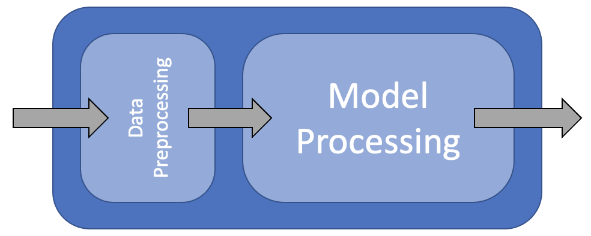

## What is Machine Learning?

Machine learning has received a lot of attention in recent years. It is a field of study that gives computers the ability to learn without being explicitly programmed. It is a subset of artificial intelligence (AI) and is often used to make predictions or classifications. Machine learning is used in many fields, including medicine, finance, and marketing.

Under the hood, machine learning algorithms are just a series of mathematical equations trying to find patterns in data. Once these patterns are represented in the form of a model, they can be used to make predictions or classifications on new data.

## What is a Model?

A model is some sort of mathematical or logical system used to represent a real-world phenomenon. For example, a linear regression model is a mathematical equation that represents the relationship between two variables. The model can then be used to make predictions about what will happen in the future.

Models generally have some assumptions or rules that they assume are true. For example, a linear regression model assumes that the relationship between two variables is linear. If this assumption is not true, then the model will not be accurate.

When trying to model a phenomenon, it is assumed that there is some underlying process that generates the data. The model is then used to represent this process. This process or relationship is often referred to as the "structure" of the problem. As well as structure, there is also "noise" in the data. This is the random variation that is not explained by the model. Teh aim of a model is to capture the structure of the data and ignore the noise.

### Parameters and Hyperparameters

A model has two types of parameters: parameters and hyperparameters. Parameters are the values that are estimated from the data. For example, in a linear regression model, the parameters are the intercept and slope. Hyperparameters are the values that are set by the user. For example, in a linear regression model, the hyperparameters are the number of variables to include in the model and the type of regression to use.

We have to be careful when choosing hyperparameters because they can have a big impact on the performance of the model. For example, if we choose too many variables to include in the model, then it will be overfit to the data and will not generalize well to new data. If we choose too few variables, then it will be underfit to the data and will not capture the structure of the data. The choice of model itself can also be considered to be a hyperparameter, so we have to be careful when choosing the model as well and make sure that it is appropriate for the problem at hand.

## What is a Workflow?

A workflow is a series of steps that are performed in order to achieve a goal. In machine learning, a workflow is a series of steps that are performed in order to build a model. The steps in a workflow can be broken down into three categories: data preparation, model building, and model evaluation.

In this course we are going to use the [tidymodels](https://www.tidymodels.org/) framework to build our models. The tidymodels framework is a collection of packages that are designed to work together to make it easier to build models. The packages in the tidymodels framework are:

- [recipes](https://www.tidymodels.org/find/recipes/): A package for data preparation
- [parsnip](https://www.tidymodels.org/find/parsnip/): A package for specifying models
- [dials](https://www.tidymodels.org/find/dials/): A package for tuning hyperparameters
- [workflows](https://www.tidymodels.org/find/workflows/): A package for building workflows
- [yardstick](https://www.tidymodels.org/find/yardstick/): A package for model evaluation

As well as these packages, we will also be using the [tidyverse](https://www.tidyverse.org/) packages for data manipulation and visualization.

{: width="600px"}

## Why use Tidymodels?

The tidymodels framework is designed to make it easier to build models. It does this by providing a consistent interface for all of the packages in the framework. This means that you can use the same code to build different types of models. For example, you can use the same code to build a linear regression model and a random forest model. This makes it easier to compare different types of models and choose the best one for your problem.

## Loading Data

```r
library(tidyverse)
library(tidymodels)
library(mlbench)
library(caret)

data(BostonHousing)
housing <- BostonHousing |>
    as_tibble()

housing |>
    glimpse()
```

```
Rows: 506
Columns: 14
$ crim    <dbl> 0.00632, 0.02731, 0.02729, 0.03237, 0.06905, 0.02985, 0.08829, 0.14455, 0.21124, 0.17004, 0.2248…
$ zn      <dbl> 18.0, 0.0, 0.0, 0.0, 0.0, 0.0, 12.5, 12.5, 12.5, 12.5, 12.5, 12.5, 12.5, 0.0, 0.0, 0.0, 0.0, 0.0…
$ indus   <dbl> 2.31, 7.07, 7.07, 2.18, 2.18, 2.18, 7.87, 7.87, 7.87, 7.87, 7.87, 7.87, 7.87, 8.14, 8.14, 8.14, …
$ chas    <fct> 0, 0, 0, 0, 0, 0, 0, 0, 0, 0, 0, 0, 0, 0, 0, 0, 0, 0, 0, 0, 0, 0, 0, 0, 0, 0, 0, 0, 0, 0, 0, 0, …
$ nox     <dbl> 0.538, 0.469, 0.469, 0.458, 0.458, 0.458, 0.524, 0.524, 0.524, 0.524, 0.524, 0.524, 0.524, 0.538…
$ rm      <dbl> 6.575, 6.421, 7.185, 6.998, 7.147, 6.430, 6.012, 6.172, 5.631, 6.004, 6.377, 6.009, 5.889, 5.949…
$ age     <dbl> 65.2, 78.9, 61.1, 45.8, 54.2, 58.7, 66.6, 96.1, 100.0, 85.9, 94.3, 82.9, 39.0, 61.8, 84.5, 56.5,…
$ dis     <dbl> 4.0900, 4.9671, 4.9671, 6.0622, 6.0622, 6.0622, 5.5605, 5.9505, 6.0821, 6.5921, 6.3467, 6.2267, …
$ rad     <dbl> 1, 2, 2, 3, 3, 3, 5, 5, 5, 5, 5, 5, 5, 4, 4, 4, 4, 4, 4, 4, 4, 4, 4, 4, 4, 4, 4, 4, 4, 4, 4, 4, …
$ tax     <dbl> 296, 242, 242, 222, 222, 222, 311, 311, 311, 311, 311, 311, 311, 307, 307, 307, 307, 307, 307, 3…
$ ptratio <dbl> 15.3, 17.8, 17.8, 18.7, 18.7, 18.7, 15.2, 15.2, 15.2, 15.2, 15.2, 15.2, 15.2, 21.0, 21.0, 21.0, …
$ b       <dbl> 396.90, 396.90, 392.83, 394.63, 396.90, 394.12, 395.60, 396.90, 386.63, 386.71, 392.52, 396.90, …
$ lstat   <dbl> 4.98, 9.14, 4.03, 2.94, 5.33, 5.21, 12.43, 19.15, 29.93, 17.10, 20.45, 13.27, 15.71, 8.26, 10.26…
$ medv    <dbl> 24.0, 21.6, 34.7, 33.4, 36.2, 28.7, 22.9, 27.1, 16.5, 18.9, 15.0, 18.9, 21.7, 20.4, 18.2, 19.9, …
```
{: .output}



