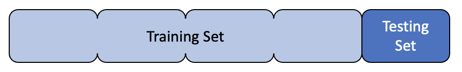
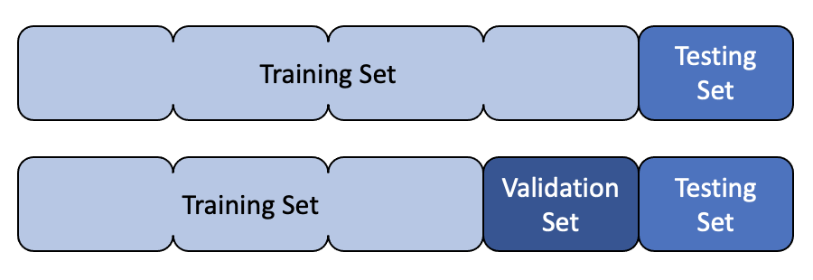
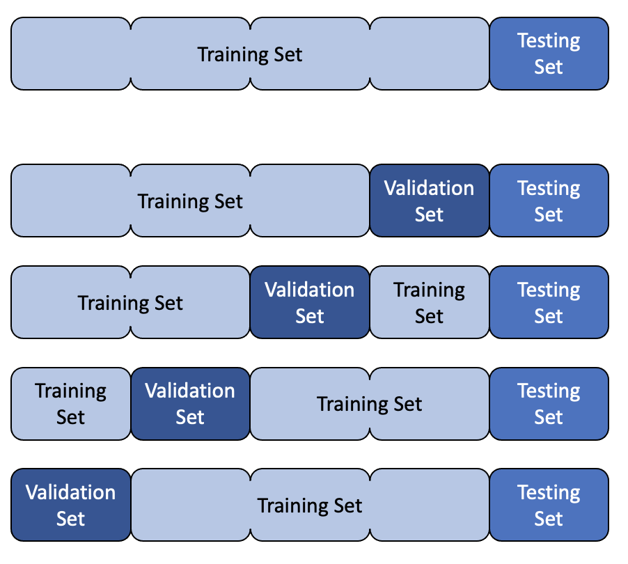
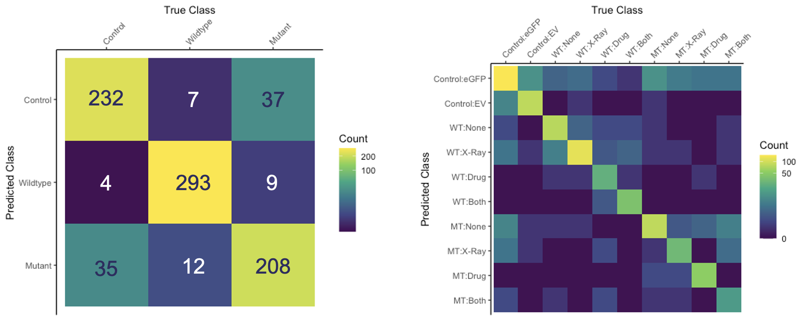
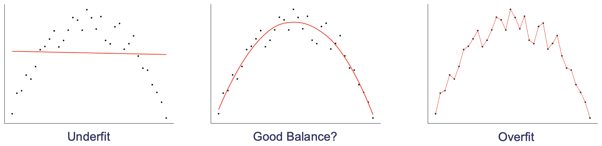

## Test/Train Split

Creating a model is all well and good, but how do we know that it is actually going to be useful in the real world? Essentially, we are asking how well does our model generalise to new data? To get an estimate of this, we can split our data into two sets: a training set and a test set. We can then train our model on the training set and evaluate it on the test set. This is known as the test/train split.

> ## What proportion of the data should be used for training?
>
> Discuss in small groups what proportion of data should be used for training. What are the advantages and disadvantages of using more or less data for training? If you have a lot of data, is it better to use more or less for training?
{: .discussion}

{: width="600px"}

## Validation Set

Let's say we have two different models and we want to know which one to choose from, or maybe even two versions of the same type of model but with different hyperparameters, how do we know which one is best? At first this seems like a simple question, we just evaluate them on the test set and choose the one with the best performance. However, this is not a good idea. The test set is used to evaluate the final model, and so we should not use it to choose the model. If we do, we are likely to overfit to the test set and our model will not generalise well to new data.

Instead, we can split our data into three sets: a training set, a validation set and a test set. We can then train our models on the training set, evaluate them on the validation set and choose the best one. We can then evaluate the final model on the test set.

{: width="600px"}

## Cross Validation

{: width="600px"}

## Model Evaluation

### Error

For regression tasks, the performance of a model is usually determined by the error. There are many different types of error, but the most common is the mean squared error (MSE). This is simply the mean of the squared differences between the true values and the predicted values. The reason for squaring the differences is that it penalises large errors more than small errors. 

### Accuracy

Accuracy is the simplest metric for evaluating a model. For classification tasks, it is simply the proportion of predictions that are correct. For regression tasks, it is the proportion of predictions that are within a certain threshold of the true value. For example, if we are trying to predict the price of a house, we might say that the prediction is correct if it is within £10,000 of the true value.

### Confusion Matrix

A confusion matrix is used to visualise the performance of a classification model. It shows the number of true positives, true negatives, false positives and false negatives. It is useful for understanding where a model is going wrong. For example, if a model is predicting a lot of false positives, it might be useful to look at the false positives and see if there is a pattern. Perhaps the model is predicting a lot of false positives for a particular class, in which case it might be useful to look at the data for that class and see if there is a problem with the data.

Confusion matrices can be extended for multiclass problems. For example, if we have three classes, we can create a 3x3 matrix where the rows represent the true classes and the columns represent the predicted classes.

{: width="800px"}

### Sensitivity and Specificity

Sensitivity and specificity are useful metrics for evaluating models when the classes are imbalanced. For example, if we are trying to predict whether a patient has a disease or not, we might have a dataset where 99% of the patients do not have the disease and only 1% do. If we were to create a model that always predicted that the patient did not have the disease, it would be 99% accurate, but it would not be very useful. Sensitivity and specificity are useful metrics for evaluating models in these situations.

Both of these can be considered as conditional probabilities. Sensitivity is the probability that the model predicts a positive result given that the true result is positive. Specificity is the probability that the model predicts a negative result given that the true result is negative. That is to say, sensitivity is the probability of a true positive and specificity is the probability of a true negative.

Plotting sensitivity and specificity against one another is often used to produce a receiver operating characteristic (ROC) curve. The area under the ROC curve (AUC) is a useful metric for evaluating models, but is not covered in this short course.

## Bias and Variance

{: width="1000px"}



