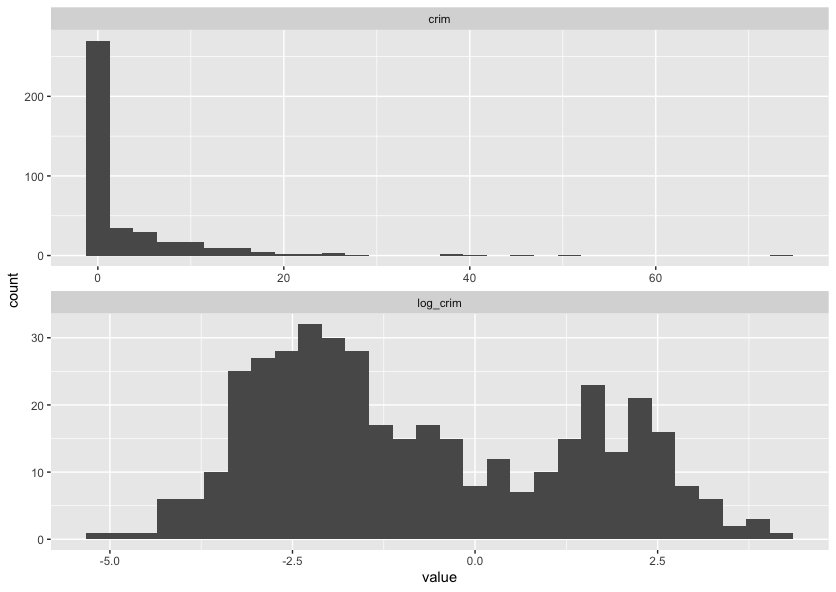

## Splitting Your Data

### Test/Train Split

The first thing that you need to do when you have your data is to split it into a training and testing set. This is so that you can train your model on one set of data and then test it on another set of data. This is important because if you train your model on all of your data then you won't have any data left to test it on. This means that you won't be able to tell if your model is overfitting to your data.

```r
housing_split <- housing |> 
  initial_split(prop = 0.8)

housing_train <- training(housing_split)

housing_test <- testing(housing_split)

housing_train
```

```
# A tibble: 404 × 14
      crim    zn indus chas    nox    rm   age   dis   rad   tax ptratio     b lstat  medv
     <dbl> <dbl> <dbl> <fct> <dbl> <dbl> <dbl> <dbl> <dbl> <dbl>   <dbl> <dbl> <dbl> <dbl>
 1  0.207      0 27.7  0     0.609  5.09  98    1.82     4   711    20.1 318.  29.7    8.1
 2 11.8        0 18.1  0     0.718  6.82  76.5  1.79    24   666    20.2  48.4 22.7    8.4
 3  0.142      0  6.91 0     0.448  6.17   6.6  5.72     3   233    17.9 383.   5.81  25.3
 4  0.0883     0 10.8  0     0.413  6.42   6.6  5.29     4   305    19.2 384.   6.72  24.2
 5  0.127      0  6.91 0     0.448  6.77   2.9  5.72     3   233    17.9 385.   4.84  26.6
 6  0.0918     0  4.05 0     0.51   6.42  84.1  2.65     5   296    16.6 396.   9.04  23.6
 7  0.0178    95  1.47 0     0.403  7.14  13.9  7.65     3   402    17   384.   4.45  32.9
 8  4.67       0 18.1  0     0.713  5.98  87.9  2.58    24   666    20.2  10.5 19.0   12.7
 9  0.141      0 13.9  0     0.437  5.79  58    6.32     4   289    16   397.  15.8   20.3
10  0.0689     0  2.46 0     0.488  6.14  62.2  2.60     3   193    17.8 397.   9.45  36.2
# ℹ 394 more rows
# ℹ Use `print(n = ...)` to see more rows
```
{: .output}

### Validation Splits

You can also use `rsample` to create validation splits. These are useful if you want to tune your model hyperparameters. You can use `vfold_cv` to create a validation split. This will create a number of folds (5 by default) and then repeat this a number of times (3 by default). You can then use these folds to tune your model (as wel will see in  a later episode).

```r
housing_folds <- vfold_cv(housing_train, v = 5, repeats = 3)

housing_folds
```

```
#  5-fold cross-validation repeated 3 times 
# A tibble: 15 × 3
   splits           id      id2  
   <list>           <chr>   <chr>
 1 <split [323/81]> Repeat1 Fold1
 2 <split [323/81]> Repeat1 Fold2
 3 <split [323/81]> Repeat1 Fold3
 4 <split [323/81]> Repeat1 Fold4
 5 <split [324/80]> Repeat1 Fold5
 6 <split [323/81]> Repeat2 Fold1
 7 <split [323/81]> Repeat2 Fold2
 8 <split [323/81]> Repeat2 Fold3
 9 <split [323/81]> Repeat2 Fold4
10 <split [324/80]> Repeat2 Fold5
11 <split [323/81]> Repeat3 Fold1
12 <split [323/81]> Repeat3 Fold2
13 <split [323/81]> Repeat3 Fold3
14 <split [323/81]> Repeat3 Fold4
15 <split [324/80]> Repeat3 Fold5
```
{: .output}

## Preprocessing Your Data

Preprocessing your data should take you a **really really really long time**. Machine learning has a *'garbage in = garbage out'* philosophy, which is to say that if you don't put useful information into your model then you won't get useful insights from your model.

Data preprocessing starts **before you collect your data**. When planning experiments or surveys it is important to have a clear question in mind and ensure that you collect all of the data that you need. Machine learning is often synonimised with 'Big Data' and therefore comes with the misconception that giving your model more data will always help it improve.  Giving your model more data points (more observations) is beneficial to model performance, but there is an effect called the 'Hughes Phenomynon" that says giving your model more variables will help to a point, but then having to deal with all of these variables will decrease the power of your model and will have a negative effect on performance.

Once you have collected your data, you might find that some (or all of) it needs transforming before it can be fed into a model. This can be done by hand, or there are ways to automate the process. To start investigating our data we can use the `skimr` package to create a short summary of each variable.

> ## What Sort of Processing Might This (or a Similar) Dataset Need?
>
> In small groups or on your own, look at the summary informations and discuss what sort of processing this data, or a similar data set might need. Remember that we will be applying our model to *unseen data* and this may have different properties to the data before you.
{: .discussion}

```r
# library(skimr)

skim(housing_train)
```

```
── Data Summary ────────────────────────
                           Values       
Name                       housing_train
Number of rows             404          
Number of columns          14           
_______________________                 
Column type frequency:                  
  factor                   1            
  numeric                  13           
________________________                
Group variables            None         

── Variable type: factor ─────────────────────────────────────────────────────────────────────────────────
  skim_variable n_missing complete_rate ordered n_unique top_counts   
1 chas                  0             1 FALSE          2 0: 375, 1: 29

── Variable type: numeric ────────────────────────────────────────────────────────────────────────────────
   skim_variable n_missing complete_rate    mean      sd        p0      p25     p50     p75    p100 hist 
 1 crim                  0             1   3.42    7.55    0.00632   0.0861   0.263   3.69   73.5   ▇▁▁▁▁
 2 zn                    0             1  10.4    22.5     0         0        0       3.12  100     ▇▁▁▁▁
 3 indus                 0             1  11.4     6.95    0.74      5.19     9.69   18.1    27.7   ▇▆▁▇▁
 4 nox                   0             1   0.556   0.117   0.389     0.453    0.538   0.624   0.871 ▇▇▅▃▁
 5 rm                    0             1   6.28    0.717   3.56      5.88     6.19    6.62    8.78  ▁▂▇▂▁
 6 age                   0             1  69.0    28.3     2.9      45.8     79.1    94.1   100     ▂▂▂▂▇
 7 dis                   0             1   3.78    2.11    1.13      2.10     3.17    5.14   12.1   ▇▅▂▁▁
 8 rad                   0             1   9.56    8.74    1         4        5      24      24     ▇▂▁▁▃
 9 tax                   0             1 409.    170.    187       280.     330     666     711     ▇▇▃▁▇
10 ptratio               0             1  18.5     2.20   12.6      17       19.1    20.2    22     ▁▃▃▅▇
11 b                     0             1 357.     90.4     0.32    375.     391.    396.    397.    ▁▁▁▁▇
12 lstat                 0             1  12.7     7.22    1.73      7.09    11.2    16.9    38.0   ▇▇▃▂▁
13 medv                  0             1  22.7     9.35    5        17.0     21.2    25      50     ▂▇▃▁▁
```
{: .output}

In 'tidymodels', we can use the 'recipes' package to create data preprocessing steps that can be pre-appended to the model. This means that when we give data to the model, the model will first use this recipe to transform the new observations and will then feed this tranformed data into the model and use that to make predictions.

> ## What are the Advantages/Disadvantages of Using Data Preprocessors Over Manually Processing Data?
>
> What are the advantages and disadvantages of using data preprocessing as part of a workflow are compared to processing new data by hand.
{: .discussion}

In this section we are going to build an extremely basic recipe to preprocess our data. You can create a recipe using the `recipe` function. This takes two arguments, the first is a formula stating what variable you are going to be predicting and what variables you would like to use as predictors (the `.` syntax is shorthand for saying "use all other variables as predictors") and the second is the data that you would like to use to create the data preprocessor.

> ## Why are We Only Using the Training Data?
>
> Why are we only using the training data to create our data preprocessor and not the full data set? What would be the problems (if any) of including the testing data in the training of the preprocessor?
{: .discussion}

```r
housing_rec <- recipe(medv ~ ., data = housing_train)

housing_rec
```

```
── Recipe ───────────────────────────────────────────────────────────────────────────────────────

── Inputs 
Number of variables by role
outcome:    1
predictor: 13
```
{: .output}

At the moment, the only information encoded in this recipe is what variable we are trying to predict and what variables we are using for prediction. One fairly standard transformation we may like to apply to our model is normalisation (or centering and scaling), to do this we create a recipe “step”. We pipe our recipe object into the step and it will create a sequence of instructions written in orser that we will apply to our data (just the same as piping multiple dplyr commands together). The function for normalising data is `step_normalize`, however we also need to tell it what variables we would like it to normalise. To do this you can explicitly type the name of the variable, use any of the `dplyr` selector functions or use some custom selector functions given by `recipes`. Here I have use a `recipes` selector function called `all_numeric_predictors()` that will transform any function registered as a predictor that is also numeric. You could also try using `all_numeric()` that will transform all variables, whether they are predictors or not.

```r
housing_rec <- recipe(medv ~ ., data = housing_train) |>
  step_normalize(all_numeric_predictors())

housing_rec
```

```
── Recipe ───────────────────────────────────────────────────────────────────────────────────────

── Inputs 
Number of variables by role
outcome:    1
predictor: 13

── Operations 
• Centering and scaling for: all_numeric_predictors()
```
{: .output}

There is a problem with this though. If we have one numeric variable where all of the entries are the same, then this will have zero variance and so when we try and normalise it we will get a divide by zero error. On top of this, a variable where all of the entries are the same is not useful for training a model, so we should probably remove them. To do this we can use a near zero variance filter, this is specified using the `step_nzv` function and this time we can apply it to all predictors as it also isn’t useful if we have a categorical variable that only contains one category. **Note:** we have put our near zero variance filter before the normalisation step as we would like the filter to be applied first.

```r
housing_rec <- recipe(medv ~ ., data = housing_train) |>
  step_nzv(all_predictors()) |> 
  step_normalize(all_numeric_predictors())

housing_rec
```

```
── Recipe ───────────────────────────────────────────────────────────────────────────────────────

── Inputs 
Number of variables by role
outcome:    1
predictor: 13

── Operations 
• Sparse, unbalanced variable filter on: all_predictors()
• Centering and scaling for: all_numeric_predictors()
```
{: .output}

There are lots of different recipe steps that you can apply (you can see them by typing `recipes::step_` and scrolling through the auto complete) and we can’t cover all of them here. So we will just give another example of how you might go through your data preprocessing. Looking at the outputs of our `skim` function, we can see that the variable `crim` has a heavy positive skew. This might indicate that a log transform could be useful here. Let’s compare the raw value of `crim` with its log transform.

```r
housing_train |>
  select(crim) |> 
  mutate(log_crim = log(crim)) |> 
  pivot_longer(cols = everything()) |> 
  ggplot() +
  aes(
    x = value
  ) +
  geom_histogram() +
  facet_wrap(
    ~ name,
    scales = "free",
    ncol = 1
  )
```



Looking at this graph, it's likely the log transform of `crim` will be more useful than the raw values, so rather than manually transforming the data using `dplyr::mutate` we can add a recipe step to do it for us.


```r
housing_rec <- recipe(medv ~ ., data = housing_train) |>
  step_log(crim) |> 
  step_nzv(all_predictors()) |> 
  step_normalize(all_numeric_predictors())

housing_rec
```

```
── Recipe ───────────────────────────────────────────────────────────────────────────────────────

── Inputs 
Number of variables by role
outcome:    1
predictor: 13

── Operations 
• Log transformation on: crim
• Sparse, unbalanced variable filter on: all_predictors()
• Centering and scaling for: all_numeric_predictors()
```
{: .output}

Most of the steps above are for dealing with numeric data, but we commonly have to deal with categorical data too. The most common way of dealing with categorical variables is through dummy variables. This means that if we have a categorical variable with $k$ categories, we create $k - 1$ new variables, one for each category. If an observation is in category $i$, then the $(i-1)$th dummy variable is set to 1 and all other dummy variables are set to 0. If the observation is in the first category though, we set all of the observations to 0, this is called the baseline. This means that we can use these dummy variables as predictors in our model. 


To do this we can use the `step_dummy` function selecting `all_factor_predictors()`. This will create dummy variables for all of the categorical predictor variables in our data set.

```r
housing_rec <- recipe(medv ~ ., data = housing_train) |>
  step_log(crim) |> 
  step_nzv(all_predictors()) |> 
  step_normalize(all_numeric_predictors()) |> 
  step_dummy(all_factor_predictors())

housing_rec
```

```
── Recipe ───────────────────────────────────────────────────────────────────────────────────────

── Inputs 
Number of variables by role
outcome:    1
predictor: 13

── Operations 
• Log transformation on: crim
• Sparse, unbalanced variable filter on: all_predictors()
• Centering and scaling for: all_numeric_predictors()
• Dummy variables from: all_factor_predictors()
```
{: .output}

At this point we should investigate every variable individually and decide what processing this variable will need, both from a machine learning point of view but also using your domain knowledge of where the data came from. There are step specifications for most, if not all, `dplyr` functions, there are extra packages that contain specifications for lots of different preprocessing steps and it is also possible to write your own.

> ## Perform Your Own Preprocessing
>
> Spend a few minutes now adding a new step to this recipe to perform some data transformation task. This could be as simple as applying a log transform to another variable or you could also look at problems such as missing data (you could look at removing or imputing missing data).
{: .challenge}

All we have done so far is tell the preprocessor what we would like to do, we haven't actually fit it yet. We can do this by calling the `prep` function at the end, which will create a trained data preprocessor that (given the code below) will log the `crim` variable, **not** remove any columns (as all of the data has non-zero variance), will subtract the mean value of the training data set from each numeric predictor and will scale each numeric predictor by the standard deviation of the training set.

```r
housing_rec <- recipe(medv ~ ., data = housing_train) |>
  step_log(crim) |> 
  step_nzv(all_predictors()) |>
  step_normalize(all_numeric_predictors()) |> 
  step_dummy(all_factor_predictors()) |> 
  prep()

housing_rec
```

```
── Recipe ───────────────────────────────────────────────────────────────────────────────────────

── Inputs 
Number of variables by role
outcome:    1
predictor: 13

── Training information 
Training data contained 404 data points and no incomplete rows.

── Operations 
• Log transformation on: crim | Trained
• Sparse, unbalanced variable filter removed: <none> | Trained
• Centering and scaling for: crim, zn, indus, nox, rm, age, dis, rad, tax, ... | Trained
• Dummy variables from: chas | Trained
```
{: .output}

To extract the transformed training data from the preprocessor we can use the `juice` function. This can be useful if you want to retrospectively see if there are any anomolies etc. included in the training data.

```r
juice(housing_rec)
```

```
# A tibble: 404 × 14
      crim      zn  indus    nox     rm    age    dis    rad     tax ptratio     b  lstat  medv chas_X1
     <dbl>   <dbl>  <dbl>  <dbl>  <dbl>  <dbl>  <dbl>  <dbl>   <dbl>   <dbl> <dbl>  <dbl> <dbl>   <dbl>
 1 -0.960   0.0643 -0.732 -1.28  -0.609 -1.70   1.34  -0.632 -0.364    0.197 0.445 -0.625  22         0
 2  1.31   -0.487   1.04   1.24  -1.13   1.11  -1.07   1.69   1.55     0.791 0.452  1.66   12.3       0
 3  0.675  -0.487   1.25   0.418  2.37   0.978 -0.819 -0.517 -0.0185  -1.72  0.159 -1.24   50         0
 4 -0.789  -0.487   0.262 -1.03  -0.615 -1.16   0.373 -0.517 -0.0483   0.105 0.443 -0.486  20.3       0
 5  2.03   -0.487   1.04   1.18  -1.23   1.11  -1.09   1.69   1.55     0.791 0.452  2.50    5         0
 6 -1.26   -0.487  -0.861 -0.360 -0.584 -0.335  0.913 -0.517 -1.09     0.791 0.430 -0.283  18.5       0
 7  1.35   -0.487   1.04   1.18   0.253  1.07  -0.975  1.69   1.55     0.791 0.400  0.629  13.1       0
 8  0.0779  0.395  -1.04   0.781  1.32   0.813 -0.876 -0.517 -0.848   -2.50  0.356 -0.625  36.5       0
 9 -1.09    3.04   -1.13  -1.37  -0.741 -1.36   1.40  -0.632 -0.412   -1.08  0.452 -0.328  19.4       0
10 -0.738   0.0643 -0.467 -0.282 -0.593 -1.07   0.834 -0.517 -0.567   -1.49  0.384  0.433  21.7       0
# ℹ 394 more rows
# ℹ Use `print(n = ...)` to see more rows
```
{: .output}

To transform new data using the data preprocessor we can use the `bake` function.

```r
bake(housing_rec, housing_test)
```

```
# A tibble: 102 × 14
     crim      zn  indus    nox     rm    age     dis    rad    tax ptratio       b  lstat  medv chas_X1
    <dbl>   <dbl>  <dbl>  <dbl>  <dbl>  <dbl>   <dbl>  <dbl>  <dbl>   <dbl>   <dbl>  <dbl> <dbl>   <dbl>
 1 -0.334  0.0643 -0.467 -0.282  0.117  0.910  1.27   -0.517 -0.567 -1.49    0.406   1.09   15         0
 2  0.378 -0.487  -0.428 -0.161 -0.526 -1.42   0.371  -0.632 -0.591  1.16    0.345  -0.837  23.1       0
 3  0.348 -0.487  -0.428 -0.161 -0.703  1.11   0.175  -0.632 -0.591  1.16    0.427   1.01   14.5       0
 4  0.504 -0.487  -0.428 -0.161 -0.504  0.469  0.124  -0.632 -0.591  1.16   -1.30    2.10   13.2       0
 5  0.418 -0.487  -0.428 -0.161 -0.866  0.935  0.0259 -0.632 -0.591  1.16    0.0465  0.800  13.1       0
 6 -0.720 -0.487  -0.748 -0.498 -0.663 -0.270 -0.173  -0.517 -0.758  0.334   0.246  -0.165  20         0
 7 -1.30   2.82   -1.19  -1.11   0.434 -1.69   0.810  -0.748 -0.919 -0.0772  0.439  -1.15   30.8       0
 8 -0.596 -0.487  -0.608 -0.939  0.688 -2.37   0.965  -0.748 -1.03  -0.260   0.330  -1.08   26.6       0
 9 -0.614 -0.487  -0.608 -0.939 -0.331 -1.04   0.965  -0.748 -1.03  -0.260   0.372  -0.424  21.2       0
10 -0.278 -0.487  -0.608 -0.939 -1.31   0.946  1.04   -0.748 -1.03  -0.260   0.452   2.53   14.4       0
# ℹ 92 more rows
# ℹ Use `print(n = ...)` to see more rows
```
{: .output}

When training a model with `tidymodels` we don't actually have to transform (or bake) the data ourselves, we can add this preproceesor to the model worflow and it will automatically be applied when we predict using the model workflow.



