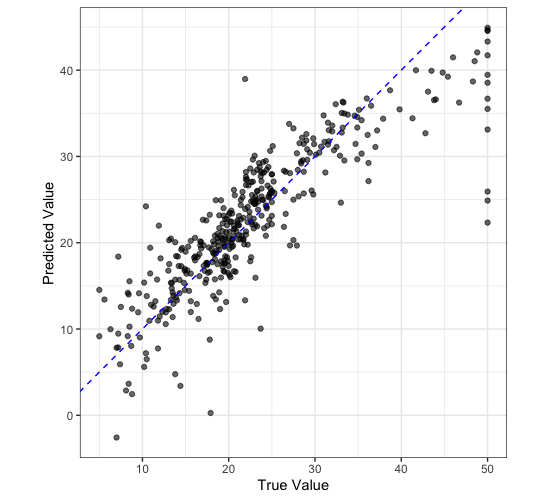

## Creating a Workflow

As discussed in the introduction, a workflow is a series of steps that are executed in order to accomplish a task, in our case this is to train or make predictions using a model. To initialise a workflow in `tidymodels` is very simple:

```r
housing_wf <- workflow()

housing_wf
```

```
══ Workflow ══════════════════════════════════════════════════════════════════════════════════════════════
Preprocessor: None
Model: None
```
{: .output}

Here you can see that our workflow object has two slots: a preprocessor and a model. We made a preprocessor object in the last session (our recipe) so we can easily add this to our workflow, we can see our workflow now in the workflow summary and the different preproessing steps involved.

```r
housing_wf <- workflow() |> 
  add_recipe(housing_rec)

housing_wf
```

```
══ Workflow ══════════════════════════════════════════════════════════════════════════════════════════════
Preprocessor: Recipe
Model: None

── Preprocessor ──────────────────────────────────────────────────────────────────────────────────────────
4 Recipe Steps

• step_log()
• step_nzv()
• step_normalize()
• step_dummy()
```
{: .output}

## Creating a Model

The next thing we need to do is to create a model object to add to the workflow. This is the power of `tidymodels` as we can create a model object without having to worry about the underlying code. We can create a model object using the `linear_reg()` function from the `parsnip` package. This function creates a model object that is a linear regression model.

```r
housing_lin_reg <- linear_reg(
  mode = "regression",
  engine = "lm"
)

housing_lin_reg
```

```
Linear Regression Model Specification (regression)

Computational engine: lm 
```
{: .output}

Here you can see we have created a linear regression model object. The `mode` argument specifies that we want to create a regression model and the `engine` argument specifies that we want to use the `lm` function from the `stats` package to fit the model. For each type of model there are many different implementations of that model (generally different packages implement them slightly differently) and the `engine` argument allows us to specify which implementation we want to use which can make quite a big difference in some circumstances.

We can also add this to our model and that's it! We have a workflow that we can use to train a model.

```r
housing_wf <- workflow() |> 
  add_recipe(housing_rec) |> 
  add_model(housing_lin_reg)

housing_wf
```

```
══ Workflow ══════════════════════════════════════════════════════════════════════════════════════════════
Preprocessor: Recipe
Model: linear_reg()

── Preprocessor ──────────────────────────────────────────────────────────────────────────────────────────
4 Recipe Steps

• step_log()
• step_nzv()
• step_normalize()
• step_dummy()

── Model ─────────────────────────────────────────────────────────────────────────────────────────────────
Linear Regression Model Specification (regression)

Computational engine: lm 
```
{: .output}

## Fitting a Workflow

Now that we have a workflow we can use it to fit a model. To do this we use the `fit()` function. This function takes two arguments: the workflow and the data. The data is the data that we want to use to train the model. In this case we want to use the training data that we created in the last session. You can see the coefficients of the model in the output below.

```r
housing_fit <- housing_wf |> 
  fit(housing_train)

housing_fit
```

```
══ Workflow [trained] ══════════════════════════════════════════════════════════════════════
Preprocessor: Recipe
Model: linear_reg()

── Preprocessor ────────────────────────────────────────────────────────────────────────────
4 Recipe Steps

• step_log()
• step_nzv()
• step_normalize()
• step_dummy()

── Model ───────────────────────────────────────────────────────────────────────────────────

Call:
stats::lm(formula = ..y ~ ., data = data)

Coefficients:
(Intercept)         crim           zn        indus          nox           rm          age  
    22.4329       0.8177       0.5474       0.1569      -2.2445       3.1357       0.1204  
        dis          rad          tax      ptratio            b        lstat      chas_X1  
    -2.4630       1.4247      -1.6586      -2.0529       1.1670      -3.9530       3.2286 
```
{: .output}

## Predicting with a Workflow

Now that we have a fitted model we can use it to make predictions. To do this we use the `predict()` function. This function takes two arguments: the fitted model and the data. The data is the data that we want to use to make predictions. In this case we want to use the test data that we created in a previous session. You can see the predictions of the model in the output below.

```r
housing_res <- housing_fit |> 
  predict(housing_train)

housing_res
```

```
# A tibble: 404 × 1
   .pred
   <dbl>
 1 21.3 
 2 12.0 
 3 39.5 
 4 22.5 
 5  9.16
 6 18.8 
 7 20.3 
 8 35.9 
 9 24.0 
10 20.4 
# ℹ 394 more rows
# ℹ Use `print(n = ...)` to see more rows
```
{: .output}

We can plot our predictions against the true values to see how well our model is doing.

```r
housing_train |> 
  select(medv) |> 
  bind_cols(housing_res) |> 
  ggplot() +
  aes(
    x = medv,
    y = .pred
  ) +
  geom_point(
    alpha = 0.6
  ) +
  geom_abline(
    slope = 1,
    colour = "blue",
    lty = 2
  ) +
  labs(
    x = "True Value",
    y = "Predicted Value"
  ) +
  coord_equal() +
  theme_bw()
```





