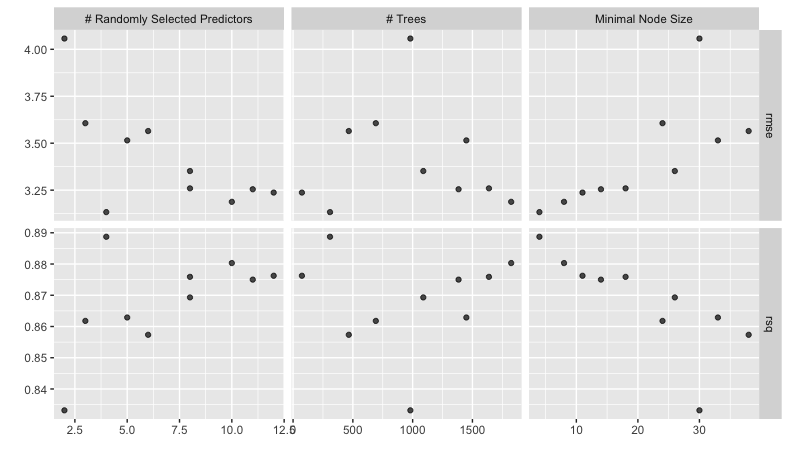
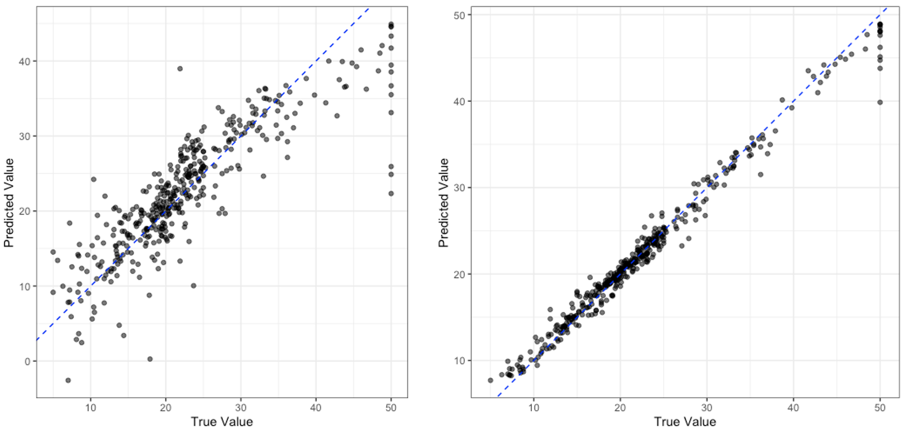

## Hyperparameter Tuning

Linear regression is considered to be a simpler model both due to its constraints and that it has no hyperparameters to tune. If you remember from a previous session, models have parameters and hyperparameters. Parameters are learnt by the model from the data but hyperparameters have to be set by us. Luckily, `tidymodels` has a lot of tools that we can use for finding the best hyperparameters and justifying the choices we make.

Hyperparameter tuning is performed in `tidymodels` using a package called `dials`. We are going to demonstrate how to use `dials` by training a random forest model, we aren't going to go into the details of how random forests work but you can see we will be able to train one anyway! When it comes to applying this in the real world, you should always research the model you are using and the basics on how it works to see if it appropriate for your use case.

> ## Identify the Hyperparameters
>
> Use `?rand_forest` to look at the help documentation for creating a random forest model. What are the hyperparameters for the model?
{: .challenge}

Firstly, lets create a new workflow object and add our recipe to it. Note how this is exactly the same as before and we are reusing the same preprocessor

```r
housing_wf_rfrst <- workflow() |> 
  add_recipe(housing_rec)
```

```
══ Workflow ════════════════════════════════════════════════════════════════════════════════
Preprocessor: Recipe
Model: None

── Preprocessor ────────────────────────────────────────────────────────────────────────────
4 Recipe Steps

• step_log()
• step_nzv()
• step_normalize()
• step_dummy()
```
{: .output}

Now we can create our model. We are going to use the `rand_forest()` function from the `parsnip` package to create a random forest model object. Rather than setting the values of the hyperparameters, we are going to set them equal to the `tune()` function. This lets `tidymodels` know that we want to tune these hyperparameters and that this isn't the final version of the model. You can see that this time we haven't selected an engine to use but it has defaulted to the `ranger` package.

```r
housing_rfrst <- rand_forest(
  mode = "regression",
  mtry = tune(),
  trees = tune(),
  min_n = tune()
)

housing_rfrst
```

```
Random Forest Model Specification (regression)

Main Arguments:
  mtry = tune()
  trees = tune()
  min_n = tune()

Computational engine: ranger 
```

We can now add this model to our workflow like before.

```r
housing_wf_rfrst <- workflow() |> 
  add_recipe(housing_rec) |> 
  add_model(housing_rfrst)

housing_wf_rfrst
```

```
══ Workflow ════════════════════════════════════════════════════════════════════════════════
Preprocessor: Recipe
Model: rand_forest()

── Preprocessor ────────────────────────────────────────────────────────────────────────────
4 Recipe Steps

• step_log()
• step_nzv()
• step_normalize()
• step_dummy()

── Model ───────────────────────────────────────────────────────────────────────────────────
Random Forest Model Specification (regression)

Main Arguments:
  mtry = tune()
  trees = tune()
  min_n = tune()

Computational engine: ranger
```
{: .output}


Next we are going to perform cross validation to select the best combination of hyperparameters to use to train the model and to do this we need to decide the combinations to test. Thankfully, `tidymodels` can do this for us. We can use the `extract_parameter_set_dials()` to extract the parameters that need tuning from the model *as well as what type of parameters they are*.

```r
tuning_params <- housing_rfrst |> 
  extract_parameter_set_dials()

 tuning_params 
```

```
Collection of 3 parameters for tuning

 identifier  type    object
       mtry  mtry nparam[?]
      trees trees nparam[+]
      min_n min_n nparam[+]

Model parameters needing finalization:
   # Randomly Selected Predictors ('mtry')

See `?dials::finalize` or `?dials::update.parameters` for more information.
```
{: .output}

You can see in the output that some hyperparameters need `finalization`. The `tidymodels` package is good at guessing different types of parameters but sometimes it needs some extra context. For example, the `mtry` parameter is the number of randomly selected predictors to use at each split which is dependent in the data set we are using (smaller datasets won't need as many) and so to get a set of reasonable values we can show the model some example data and it can use this to estimate a good parameter range. We do this using the `finalize()` function, passing through our training data set.

```r
tuning_params <- housing_rfrst |> 
  extract_parameter_set_dials() |> 
  finalize(housing_train)

tuning_params
```

```
Collection of 3 parameters for tuning

 identifier  type    object
       mtry  mtry nparam[+]
      trees trees nparam[+]
      min_n min_n nparam[+]
```
{: .output}

Now we can start generating sets of values to test, the simplest method for doing this is using a tuning grid. To create one, a predefined number of values are selected for each hyperparameter and every combination of these values is tested. We do this using the `grid_regular()` function, passing through the tuning parameters we extracted from the model and the number of values we want to test for each hyperparameter as 'levels'. There are other, arguably more sophisticated, methods for generating tuning grids, you may wish to try using `grid_max_entropy()` or `grid_latin_hypercube()` instead (*hint:* if you wish to use these you will need to replace the `levels` argument with `size`). We are going to use 100 values for each hyperparameter.

```r
tuning_grid <- grid_regular(
  tuning_params,
  levels = 100
)

tuning_grid
```

```
# A tibble: 54,600 × 3
    mtry trees min_n
   <int> <int> <int>
 1     1     1     2
 2     2     1     2
 3     3     1     2
 4     4     1     2
 5     5     1     2
 6     6     1     2
 7     7     1     2
 8     8     1     2
 9     9     1     2
10    10     1     2
# ℹ 54,590 more rows
# ℹ Use `print(n = ...)` to see more rows
```
{: .output}

Now that we have the combinations of hyperparameters that we would like to test we can use the `tune_grid()` function to train a model with each of these hyperparameter combinations. Rather than passing `tune_grid()` `housing_train` we have passed it `housing_folds` which has the specification for our cross validation sets.

```r
housing_rfrst_tuning <- housing_wf_rfrst |> 
  tune_grid(
    housing_folds,
    tuning_params
  )

housing_rfrst_tuning
```

```
# Tuning results
# 5-fold cross-validation repeated 3 times 
# A tibble: 15 × 5
   splits           id      id2   .metrics          .notes          
   <list>           <chr>   <chr> <list>            <list>          
 1 <split [323/81]> Repeat1 Fold1 <tibble [20 × 7]> <tibble [0 × 3]>
 2 <split [323/81]> Repeat1 Fold2 <tibble [20 × 7]> <tibble [0 × 3]>
 3 <split [323/81]> Repeat1 Fold3 <tibble [20 × 7]> <tibble [0 × 3]>
 4 <split [323/81]> Repeat1 Fold4 <tibble [20 × 7]> <tibble [0 × 3]>
 5 <split [324/80]> Repeat1 Fold5 <tibble [20 × 7]> <tibble [0 × 3]>
 6 <split [323/81]> Repeat2 Fold1 <tibble [20 × 7]> <tibble [0 × 3]>
 7 <split [323/81]> Repeat2 Fold2 <tibble [20 × 7]> <tibble [0 × 3]>
 8 <split [323/81]> Repeat2 Fold3 <tibble [20 × 7]> <tibble [0 × 3]>
 9 <split [323/81]> Repeat2 Fold4 <tibble [20 × 7]> <tibble [0 × 3]>
10 <split [324/80]> Repeat2 Fold5 <tibble [20 × 7]> <tibble [0 × 3]>
11 <split [323/81]> Repeat3 Fold1 <tibble [20 × 7]> <tibble [0 × 3]>
12 <split [323/81]> Repeat3 Fold2 <tibble [20 × 7]> <tibble [0 × 3]>
13 <split [323/81]> Repeat3 Fold3 <tibble [20 × 7]> <tibble [0 × 3]>
14 <split [323/81]> Repeat3 Fold4 <tibble [20 × 7]> <tibble [0 × 3]>
15 <split [324/80]> Repeat3 Fold5 <tibble [20 × 7]> <tibble [0 × 3]>
```
{: .output}

This is hard for us to interpret and so we can use the `collect_metrics()` function to extract the metrics we are interested in.

```r
housing_rfrst_tuning |> 
  collect_metrics()
```

```
# A tibble: 20 × 9
    mtry trees min_n .metric .estimator  mean     n std_err .config              
   <int> <int> <int> <chr>   <chr>      <dbl> <int>   <dbl> <chr>                
 1     8  1089    26 rmse    standard   3.35     15  0.186  Preprocessor1_Model01
 2     8  1089    26 rsq     standard   0.869    15  0.0131 Preprocessor1_Model01
 3    11  1384    14 rmse    standard   3.25     15  0.180  Preprocessor1_Model02
 4    11  1384    14 rsq     standard   0.875    15  0.0122 Preprocessor1_Model02
 5     4   309     4 rmse    standard   3.13     15  0.188  Preprocessor1_Model03
 6     4   309     4 rsq     standard   0.889    15  0.0124 Preprocessor1_Model03
 7     6   466    38 rmse    standard   3.56     15  0.195  Preprocessor1_Model04
 8     6   466    38 rsq     standard   0.857    15  0.0144 Preprocessor1_Model04
 9     8  1638    18 rmse    standard   3.26     15  0.186  Preprocessor1_Model05
10     8  1638    18 rsq     standard   0.876    15  0.0127 Preprocessor1_Model05
11     5  1449    33 rmse    standard   3.51     15  0.194  Preprocessor1_Model06
12     5  1449    33 rsq     standard   0.863    15  0.0144 Preprocessor1_Model06
13     3   692    24 rmse    standard   3.61     15  0.197  Preprocessor1_Model07
14     3   692    24 rsq     standard   0.862    15  0.0151 Preprocessor1_Model07
15    12    74    11 rmse    standard   3.24     15  0.178  Preprocessor1_Model08
16    12    74    11 rsq     standard   0.876    15  0.0118 Preprocessor1_Model08
17    10  1824     8 rmse    standard   3.19     15  0.180  Preprocessor1_Model09
18    10  1824     8 rsq     standard   0.880    15  0.0120 Preprocessor1_Model09
19     2   981    30 rmse    standard   4.06     15  0.201  Preprocessor1_Model10
20     2   981    30 rsq     standard   0.833    15  0.0178 Preprocessor1_Model10
```
{: .output}

We can also quickly create a plot to visualise the results.

```r
autoplot(housing_rfrst_tuning)
```



To select the *"best"* model we can use the `select_best()` function. We pass these all of the tuning results and the metric we are interested in optimising. In this case we are interested in the model with the highest R-squared.

```r
best_params <- housing_rfrst_tuning |> 
  select_best("rsq")

best_params
```

```
# A tibble: 1 × 4
   mtry trees min_n .config              
  <int> <int> <int> <chr>                
1     4   309     4 Preprocessor1_Model03
```
{: .output}

Now we need set the parameters in our workflow model to be the best parameters we have idenified above. If we take a look at our workflow object, it looks like this

```r
housing_wf_rfrst
```

```
══ Workflow ════════════════════════════════════════════════════════════════════════════════
Preprocessor: Recipe
Model: rand_forest()

── Preprocessor ────────────────────────────────────────────────────────────────────────────
4 Recipe Steps

• step_log()
• step_nzv()
• step_normalize()
• step_dummy()

── Model ───────────────────────────────────────────────────────────────────────────────────
Random Forest Model Specification (regression)

Main Arguments:
  mtry = tune()
  trees = tune()
  min_n = tune()

Computational engine: ranger 
```
{: .output}

We can then set the hyperparameters using the `finalize_workflow()` function. We pass this the workflow object and the best parameters we have identified.

```r
housing_wf_rfrst |> 
  finalize_workflow(best_params)
```

```
══ Workflow ════════════════════════════════════════════════════════════════════════════════
Preprocessor: Recipe
Model: rand_forest()

── Preprocessor ────────────────────────────────────────────────────────────────────────────
4 Recipe Steps

• step_log()
• step_nzv()
• step_normalize()
• step_dummy()

── Model ───────────────────────────────────────────────────────────────────────────────────
Random Forest Model Specification (regression)

Main Arguments:
  mtry = 4
  trees = 309
  min_n = 4

Computational engine: ranger 
```

As well as finalizing the workflow, we can fit the model to the training data using the `fit()` function like before and now we have a fully tuned and trained model.

```r
housing_rfrst_fit <- housing_wf_rfrst |> 
  finalize_workflow(best_params) |> 
  fit(housing_train)


housing_rfrst_fit
```

```
══ Workflow [trained] ══════════════════════════════════════════════════════════════════════
Preprocessor: Recipe
Model: rand_forest()

── Preprocessor ────────────────────────────────────────────────────────────────────────────
4 Recipe Steps

• step_log()
• step_nzv()
• step_normalize()
• step_dummy()

── Model ───────────────────────────────────────────────────────────────────────────────────
Ranger result

Call:
 ranger::ranger(x = maybe_data_frame(x), y = y, mtry = min_cols(~4L,      x), num.trees = ~309L, min.node.size = min_rows(~4L, x),      num.threads = 1, verbose = FALSE, seed = sample.int(10^5,          1)) 

Type:                             Regression 
Number of trees:                  309 
Sample size:                      404 
Number of independent variables:  13 
Mtry:                             4 
Target node size:                 4 
Variable importance mode:         none 
Splitrule:                        variance 
OOB prediction error (MSE):       9.67719 
R squared (OOB):                  0.8873346 
```
{: .output}

Just like before, we can then use the `predict()` function to generate predictions and then plot the results, as we have seen in the previous section.

```r
housing_rfrst_res <- housing_rfrst_fit |> 
  predict(housing_train)

housing_train |> 
  select(medv) |> 
  bind_cols(housing_res) |> 
  ggplot() +
  aes(
    x = medv,
    y = .pred
  ) +
  geom_point(
    alpha = 0.6
  ) +
  geom_abline(
    slope = 1,
    colour = "blue",
    lty = 2
  ) +
  labs(
    x = "True Value",
    y = "Predicted Value"
  ) +
  coord_equal() +
  theme_bw()
```


This is not the most robust of tests, but to look at how much better our tuned random forest model is compared to the linear regression model we can compare these truth vs. prediction plots.



> ## Comparing Models
>
> Which model do you think is performing better? Do you think you can be confident of your answer *only using the plot above*? Who or why not?
{: .challenge}


